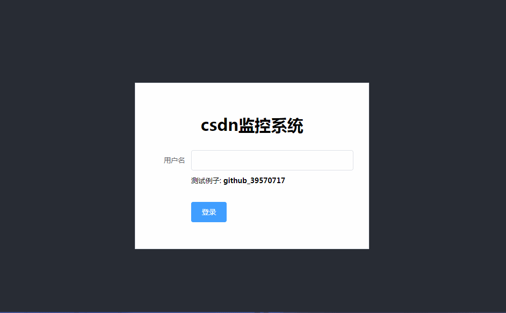
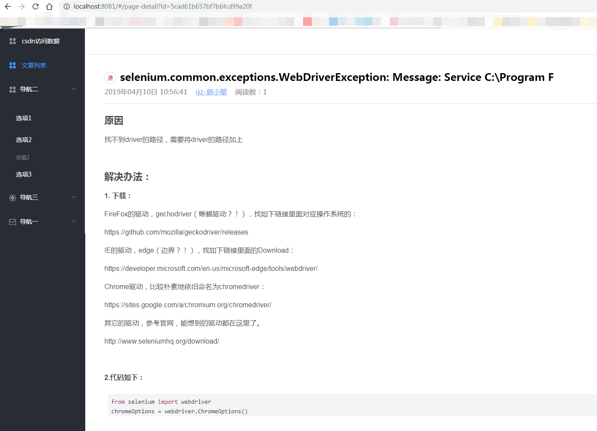
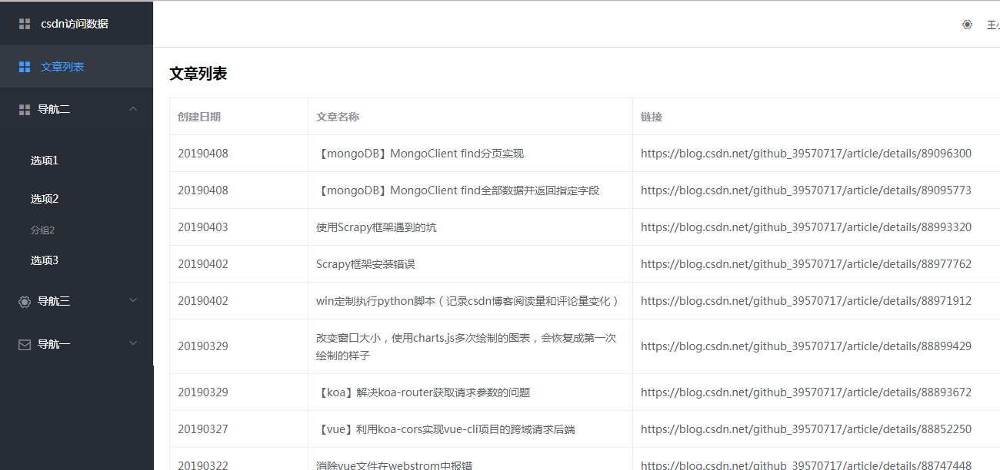
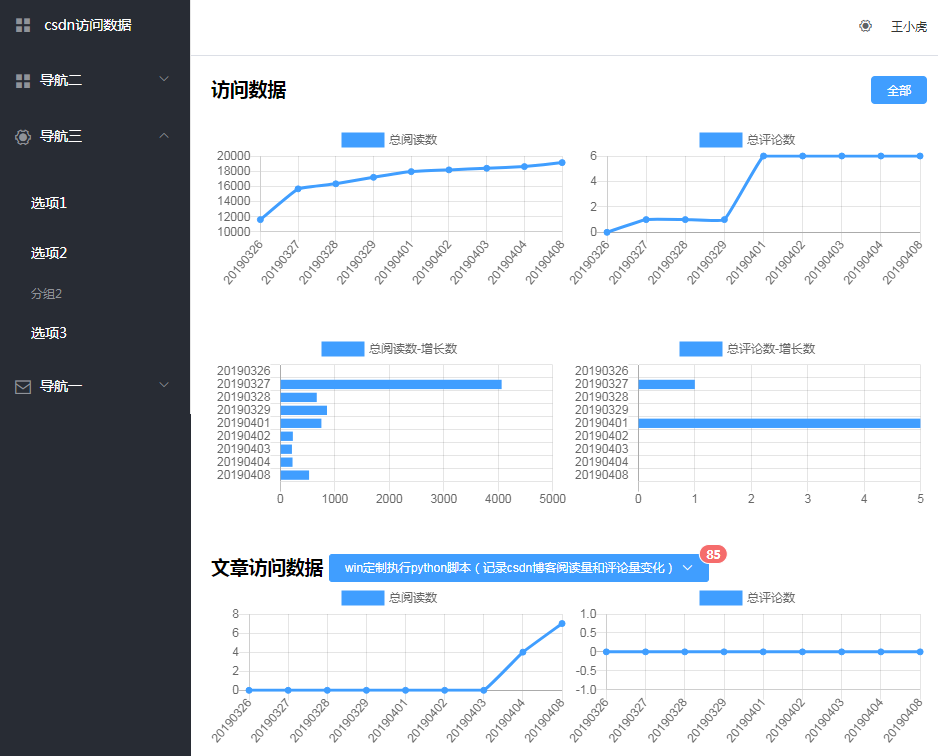

# data-management

> csdn个人博客每日阅读量和访问量统计的前后端,数据来源依赖爬虫(https://github.com/guosimin/python-spider/tree/master/csdnTest)

## Build Setup

1.下载代码，并启动并构建前端项目     
```
# install dependencies

npm install

# serve with hot reload at localhost:8080

npm run dev
```
2.启用后端   

```
node app.js
```
3.启动完成后访问：http://localhost:8081/#/charts   

### 可视化的视图展示效果：   



## last UPdate   
* 20190417:       
1.新增登录、退出功能       
2.新增vuex状态管理      
3.优化文章列表查询     
4.新增个人中心页面     
5.优化项目目录结构           

  
* 20190415:         
1.~~去除首页单篇文章阅读量和评论量功能~~          
2.文章列表新增阅读数和评论数展示      
3.首页新增时间筛选功能      
4.根据数据库结构调整，调整请求参数       


* 20190410:     
1.新增文章跳转详情功能     
2.详情引入csdn样式     
3.新增hightlight组件          
    


* 20190409:     
1.新增文章列表视图     
2.修复页面加载问题     
3.修改chart展示错误问题     
4.新增分页请求参数统一处理     
5.实现文章列表翻页  
    



* 20190408:     
1.新增增长数视图     
    


